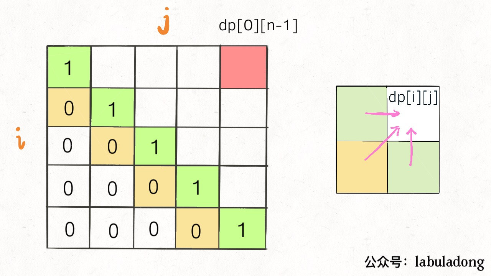
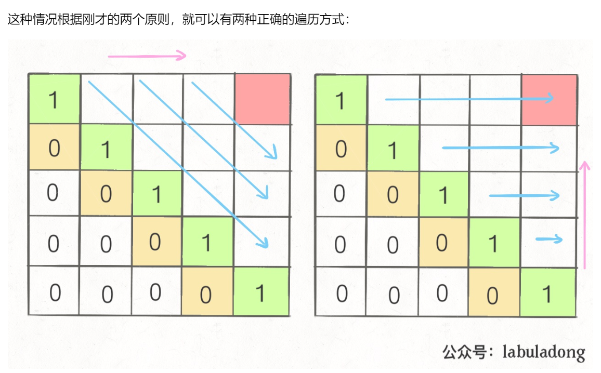

## leetcode链接：
https://leetcode-cn.com/problems/longest-palindromic-substring/

## 解法1：暴力搜索
时间复杂度：O(n<sup>3</sup>)

## 解法2：动态规划
1. 第 1 步：定义状态
`dp[i][j]` 表示子串 `s[i, j]` 是否为回文子串。

2. 第 2 步：思考状态转移方程
首先可以确定的是 `j>=i` 必然成立，`d[i][j] == true`, when `i==j`;
其次，递推关系`dp[i][j] = (s[i] == s[j]) && dp[i + 1][j - 1]`成立的条件是j>=i+2；
最后，考虑`j==i+1`的情况，`dp[i][j] = s[i] == s[j]`；

3. 第 3 步：考虑base case
初始化的时候，单个字符一定是回文串，因此把对角线先初始化为 1，即 `dp[i][i] = 1`；

### 动态规划的遍历方向
这里值得一提的是本题的动态规划的遍历方向，大部分情况下dp二维数组都是两个行、列由小到大的嵌套循环，诸如：
```
for (int i = 0; i < rows; i++) {
   for (int j = 0; i < cols; j++) {
   }
}
```
但注意在本题中，主要的递推关系是`dp[i][j] = (s[i] == s[j]) && dp[i + 1][j - 1]`，在二维数组中是由`左下向右上`递推的：




由此，可以引申出来一个动态规划递推的tip：

**1. 遍历的过程中，所需的状态必须是已经计算出来的。**

**2. 遍历的终点必须是存储结果的那个位置。**


根据上面两个tip，对于本题:



```cpp
class Solution {
public:
    string longestPalindrome(string s) {
        if (s.length() <= 1) {
            return s;
        }
        vector<vector<bool>> dp(s.length(), vector<bool>(s.length()));
        int max= 1;
        string str = s.substr(0, 1);
        for (int i = s.length()-1; i >= 0; i--) {
            dp[i][i] = true;
            for (int j = i; j < s.length(); j++) {
                if (j>i+1) {
                    dp[i][j] = dp[i+1][j-1]&&s[i]==s[j];
                } else if (j == i+1) {
                    dp[i][j] = s[i]==s[j];
                }
                if (dp[i][j] && j-i+1 > max) {
                    max = j-i+1;
                    str = s.substr(i, j-i+1);
                }
            }
        }
        return str;
    }
};
```

## 解法3：中心扩散法
时间复杂度O(n<sup>2</sup>)，空间复杂度O(1)

主要思路是先假定以某点为中心向两端扩散，找到以该点为中心的最长回文子串。值得注意的是待检查的`某点`可能是某个字符、也可能是两个字符中间的虚拟点。
```cpp
class Solution {
public:
    
    int rx, ry;
    void helper(string &s, int i, int offset){
        int left = i;
        int right = i + offset;
        while(left >= 0 && right < s.size() && s[left] == s[right]){
            left--;
            right++;
        }
        
        if(right - 1 - (left + 1) > ry - rx){
            ry = right - 1;
            rx = left + 1;
        } 
    }
    string longestPalindrome(string s) {
        int n = s.size();
    
        rx = ry = 0;
       
        for(int i = 0; i < n; i++){
            helper(s, i, 0);
            helper(s, i, 1);
        }
        
        return s.substr(rx, ry - rx + 1);
    }
};
```